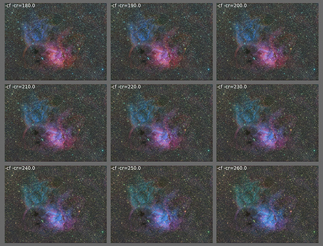

# dimred

 

Color mapping is always challenging in astrophotography, especially when we have observations of the same astronomical object in multiple spectral bands. Here I propose a possible method to approach this problem based on a well-known machine learning algorithm borrowed from classic statistics, the Principal Component Analysis (PCA), to compress information from the multiband input data into RGB channels while minimizing information loss. This technique could also be applied to narrowband-only "SHO" data to find an encoding that deals with the typical H-alpha overwhelming signal. 

More info about this approach in the [blog page](https://expandingastro.blogspot.com/2021/12/multiband-mapping-for-astrophotography.html). 

**Please cite this repo** if you use this code or some derivative to produce images to be published: "*Color mapping based on [dimred](https://github.com/sergio-dr/dimred_astro) tool by Sergio Díaz*". 


## Command line help

```
usage: dimred.py [-h] [-df DOWNSCALE_FACTOR] [-qm QUANTILE_MIN]
                 [-qM QUANTILE_MAX] [-cr CHROMA_ROTATION]
                 [-ce CHROMA_ROTATION_END] [-cf] [-lf] [-e EXPLORE]
                 input_files output_file
```

Maps multiple bands or channels (given as a bunch of monochromatic image TIFF files) into a RGB color image. 
Input data is transformed by a PCA (Principal Components Analysis) algorithm to reduce the dimensionality, 
effectively compressing the information to three components: the first one (which has the most variance) is 
interpreted as luminance data, while the second and third components are interpreted as chrominance data. 
This implementation places this luminance/chrominance data CIELAB color space and then performs its 
conversion to RGB. 

The chrominance data (a, b components) can be rotated and flipped to generate different color mappings. 
The --explore N option is useful to explore different color palettes: it generates a NxN mosaic with different
values for chroma rotation [CHROMA_ROTATION, CHROMA_ROTATION_END) and flipping. Be sure to use it along with 
a high DOWNSCALE_FACTOR to speed computations. Every image in the mosaic shows the chroma command line 
parameters needed to generate it. 

In some cases, --luma-flip may be needed if an inverted image is generated.

The input files are assumed to be in non-linear stage (i.e., previously stretched), or you may try the included 
but simple --strech option. 

Supported file formats:
* Input files: tif (16 bits), png (16 bits), xisf (float 32/64 bits), npz (float 32 bits, 'data' key)
* Output files: tif (16 bits), xisf (float 32/64 bits), npz (float 32 bits, 'data' key)
* Output files for exploratory mode: tif (8 bits), png (8 bits)

Examples:
* Basic usage:
```
  dimred.py *.tif output\pca.tif -cr 30 
```  

* Exploratory mode, with 5x5 chroma rotation values in the range [30º, 120º], downscaling by 8: 
```
  dimred.py *.tif output\pca.tif -e 5 -df 8 -cr 30 -cr 120
```

Note: this tool requires the xisf package, see https://github.com/sergio-dr/xisf

```
positional arguments:
  input_files           Input files specified using wildcards, e.g. '*.tif'
  output_file           Output filename

optional arguments:
  -h, --help            show this help message and exit
  -df DOWNSCALE_FACTOR, --downscale-factor DOWNSCALE_FACTOR
                        Integer downscaling factor to speed up computation, as a preview (optional)
  -qm QUANTILE_MIN, --quantile-min QUANTILE_MIN
                        Quantile range for chroma scaling, minimum value (optional)
  -qM QUANTILE_MAX, --quantile-max QUANTILE_MAX
                        Quantile range for chroma scaling, maximum value (optional)
  -cr CHROMA_ROTATION, --chroma-rotation CHROMA_ROTATION
                        Angle (in degrees) for specifying chroma components rotation; will be interpreted as initial angle in --explore mode (optional)
  -ce CHROMA_ROTATION_END, --chroma-rotation-end CHROMA_ROTATION_END
                        End angle (in degrees) for in --explore mode; by default, 360º+CHROMA_ROTATION (optional)
  -cf, --chroma-flip
  -lf, --luma-flip
  -e EXPLORE, --explore EXPLORE
                        Exploratory mode: given an integer N, generates a NxN mosaic with the --chroma-angle range specified (optional)
```
